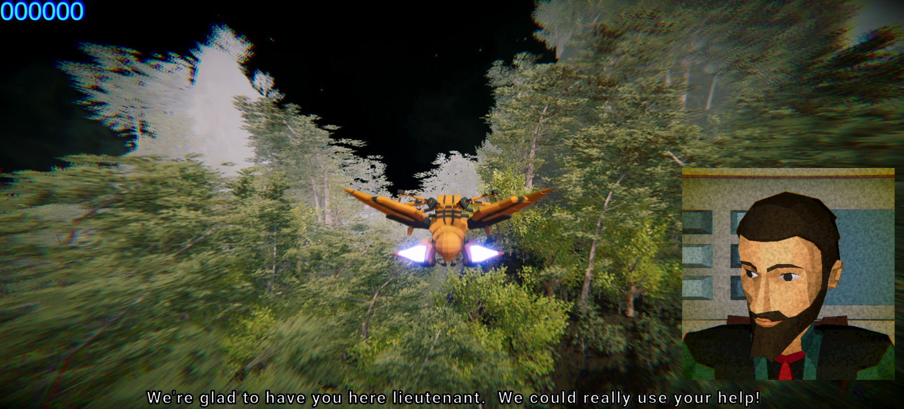
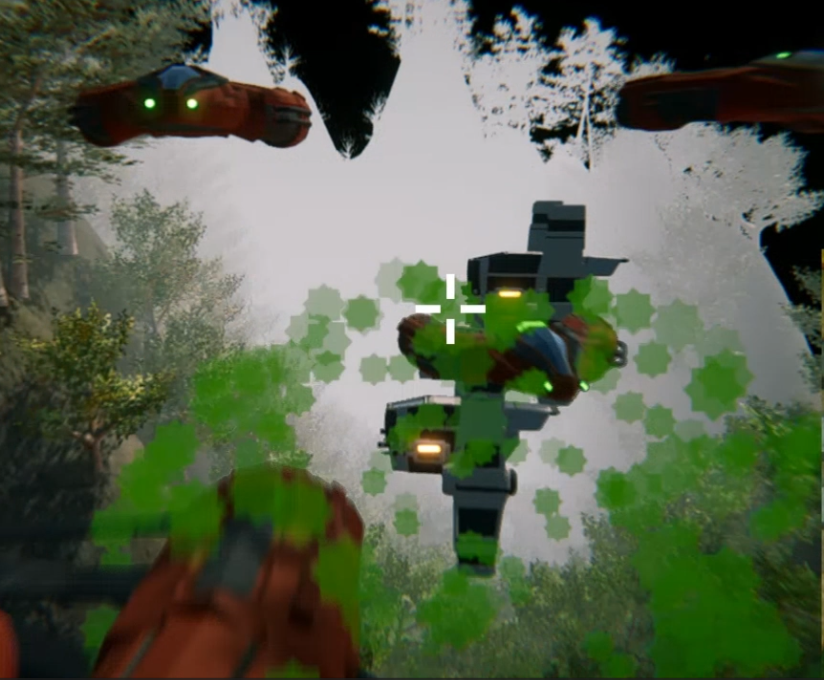
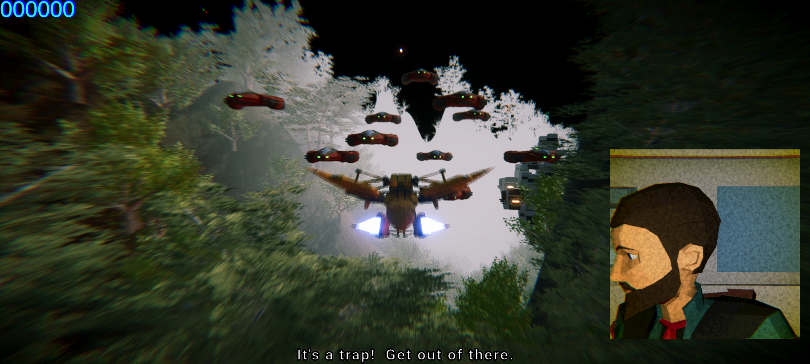
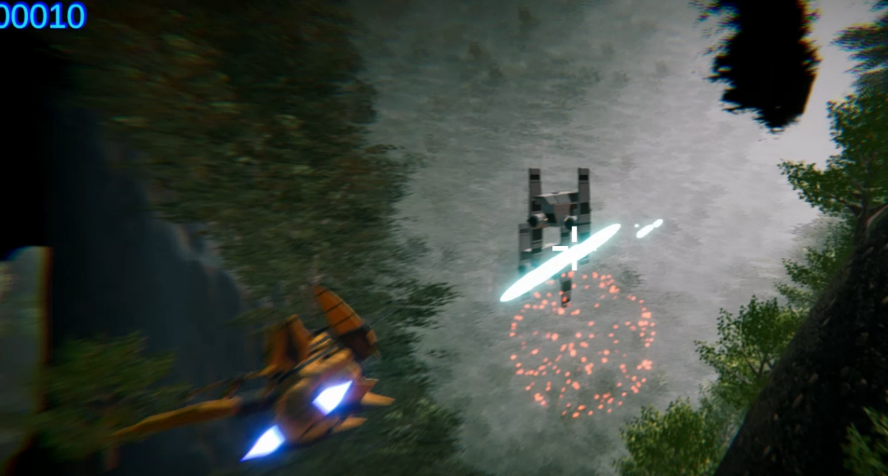

# Galaxy Strike

Galaxy Strike is a space shooter game built in Unity. The player follows a predetermined path while engaging enemy ships using a laser weapon.

* If the player collides with an enemy or any terrain object, the game ends and restarts.
* Each destroyed enemy rewards the player with points.

---

## Features & Gameplay

* Enemies are placed along a fixed path and animated.
* The player uses a laser to destroy enemies while avoiding obstacles.
* Collisions with enemies or terrain objects result in game over.
* Points are earned for every enemy destroyed.

---

## What I Learned & Implemented

* Terrain creation and management
* Camera angle adjustments for cinematic view
* Animation workflow in Unity
* **Quaternion rotation** for aligning lasers with the crosshair
* Dialogue system integration
* UI Canvas setup for crosshair and scoreboard
* Prefab usage and prefab variants for efficient workflow

---

## Controls

* **Mouse** → Lasers follow the crosshair (aiming system).
* **WASD** → Player movement is restricted using the `Clamp` function, allowing smooth control within specific boundaries.

---

## ScreenShots
Some in-game moments:

### 🟢 Start

The game’s starting screen. The player’s ship is ready, and the UI elements are positioned on the screen.

### 💥 Crash

When the player’s ship collides with an enemy or a terrain object, the game ends. Crash animation and restart mechanics are triggered.

### 🚀 Enemies

Enemy ships appearing on the route. Each has different hitpoints, and destroying them rewards the player with score points.

### 🔫 Shooting

Lasers are fired in the direction of the crosshair. Thanks to quaternion calculations, projectiles accurately follow the aim point.

